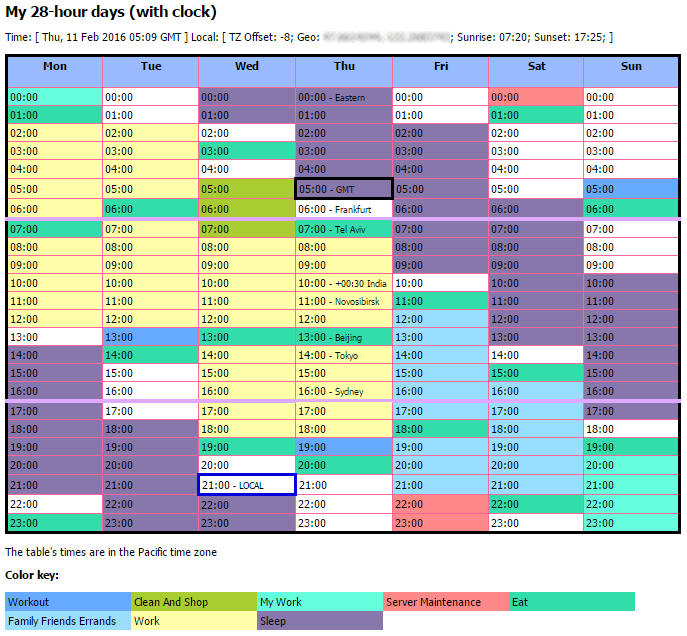

# SleepShift

> Display a week of 21, 24, or 28-hour days (with a world clock)

Originally created to shift the sleep times of my 28-hour days, to find
the right schedule that worked for me. But you can adjust the numbers to
display any regular sleep schedule that fits evenly in a week.

It's also got an hourly world clock. And, if you host it from a web server,
it'll show sunrise and sunset.<sup><a href="#sup1">1</a></sup>



## To use it

0. Throw these files on a web server: `sleepshift.js`, `sleepshift.css`

0. Slap this code in your web page:

  In the header:
  ```html
  <link rel="stylesheet" type="text/css" href="sleepshift.css">
  <script src="https://ajax.googleapis.com/ajax/libs/jquery/1.12.0/jquery.min.js"></script>
  <script type="text/javascript" src="sleepshift.js"></script>
  ```

  In the body, where you want it displayed:
  ```html
  <div id="sleepshift"></div>
  ```

  In the body, at the very bottom:
  ```html
  <script type="text/javascript">
    $(document).ready(function(){
      SleepShift.drawMyCal();
    });
  </script>
  ```
With that, you'll get a default [xkcd 28-hour day][xkcd] with no extras.

### Tweaking the sleep hours

You can add values to `drawMyCal()` to change the length and shift the
times of your days.
```javascript
SleepShift.drawMyCal(totalhours, wakehours, offset)
```

<dl>
  <dt>totalhours</dt>
  <dd>The total hours in <i>your</i> day. Not necessarily 24.
  Reasonable day lengths that fit evenly in a normal 168 hour week are:
  12, 14, 21, 24, and 28.</dd>
  
  <dt>wakehours</dt>
  <dd>Number of hours in <i>your</i> day that you want to be awake.</dd>

  <dt>offset</dt>
  <dd>The week starts at 00:00 Monday (cell 0). Adjust the offset
  to the hour on -Sun or +Mon when you first wake up during the
  week. Examples:
  <ul><li>To start your week at midnight Sunday, use 0.</li>
      <li>To start your week at 8 a.m. on Monday, use 8.</li>
      <li>To start your week at 7 p.m. on Sunday, use -5.</li>
  </ul></dd>
</dl>

A normal person's week ;-)
```javascript
SleepShift.drawMyCal(24, 16, 7);
```

The default with no values is the same as:
```javascript
SleepShift.drawMyCal(28, 20, -6);
```

### Displaying other things

To customize it further, you can use the `init()` function before running
`drawMyCal()`.

#### Example

```javascript
SleepShift.init({
  title: "My crazy week",
  sleepcolor: "777",
  mytimezonename: "Eastern",
  tzhash: {
    "Mountain":     -7,
    "Frankfurt":     1,
    "+00:30 India":  5
  },
  cellstyles: {
    "workout": ["6af",[37,91,149]],
    "my-work": ["6fd",[0,164,165,166,167]]
  }
});
SleepShift.drawMyCal();
```

#### Reference

|    Property    |                         Format                            |            Default value             |
| -------------- | --------------------------------------------------------- | ------------------------------------ |
| title          | string                                                    | "My 28-hour days (with world clock)" |
| mytimezonename | string                                                    | ""                                   |
| sleepcolor     | string - "0x[0x]0x[0x]0x[0x]"                             | "87a"                                |
| tzhash         | object - { "time zone name": signed-integer offset, ... } | {}                                   |
| cellstyles     | object - { "name": ["color", [list of cells]], ... }      | {}                                   |
| debug          | boolean                                                   | false                                |

<dl>
  <dt>title</dt>
  <dd>Whatever you wanna call the table.</dd>
  <dt>mytimezonename</dt>
  <dd>Where you're at. Prints a statement below the table with this value.</dd>
  <dt>sleepcolor</dt>
  <dd>So, you don't like slate purple? Change it here, maybe something like
  gray "777" or "8a8a8a".</dd>
  <dt>tzhash</dt>
  <dd>The cell with the current GMT (black border) and the cell with the viewer's
  local time (blue border) are displayed automatically. To have other time zones
  listed at their current hour, list each with a name of your choice and
  <a href="https://en.wikipedia.org/wiki/List_of_tz_database_time_zones">its
  hour offset</a>.
  <p>And, sorry, there's no daylight savings feature yet. When the time comes,
  you gotta change affected values (along with all the clocks in your house).
  :O)</p></dd>
  <dt>cellstyles</dt>
  <dd>Use this property to add other events (work hours, etc.).
  For each event you want to add to the table, provide its name, separating
  multi-word names with hyphens. (In the color key that's displayed below the
  table, hyphens become spaces and the words are init-capped.) With each name,
  provide an HTML "#" color value (either 3 or 6 hex digits) and the cell numbers
  to apply the event to.</dd>
  <dt>debug</dt>
  <dd>"But wait, how do I know what the cell numbers are?" Great question.
  To see the cell numbers, set debug to true.</dd>
</dl>

For a more complete example, the values in the [`index.html`](index.html) file were
used to display the picture above.

So, there ya go. Have fun!

---
<a name="sup1"></a><sup>1</sup>Sunrise and sunset are determined by your geolocation.
And browser geolocation is only available from web pages hosted on a web server.

## License

[The MIT License (MIT)][lic]


[xkcd]: https://xkcd.com/320/
[lic]: LICENSE
